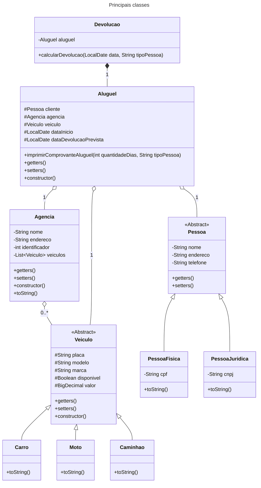

  
  <h1 style="font-size: 20px;"><b>LOCADORA DE VEÍCULOS</b></h1>

<h1 align="center">
  
</h1>

<b>Módulo 3: Programação Orientada a Objetos II</b> Projeto desenvolvido pelo grupo 5 da turma 1173 do programa <b>Santander Coders</b> 2024.1 em parceria com a <b>Ada Tech</b>

## Objetivos do Projeto
Criar uma aplicação que gerencie o aluguel de veículos, onde cada item abaixo seja considerado:
- Cadastrar os veículos;
- Alterar um veículo cadastrado;
- Buscar um veículo por parte da placa;
- Cadastrar a agência onde o veículo será alugado/devolvido;
- Alterar a agência onde o veículo será alugado/devolvido;
- Buscar uma agência por parte do nome ou do logradouro do endereço;
- Cadastrar o cliente (pessoa física/jurídica);
- Alterar o cliente (pessoa física/jurídica);
- Alugar um veículo para pessoa física;
- Alugar um veículo para pessoa jurídica;
- Devolver um veículo para pessoa física;
- Devolver um veículo para pessoa jurídica;
- Gerar um comprovante com todos os dados do aluguel (aberto para o grupo decidir o que vai ser demonstrado);
- Gerar um comprovante com todos os dados da devolução (aberto para o grupo decidir o que vai ser demonstrado).

## Regras de Negócio
**RN1**: Os veículos não podem ser repetidos;

**RN2:** Tipos de veículos que serão considerados: carro, moto e caminhão;

**RN3:** Os aluguéis e devoluções terão o local, data e horário;

**RN4:** Os veículos que estiverem alugados não poderão estar disponíveis;

**RN5:** Agências não podem estar duplicadas;

**RN6:** Clientes não podem estar duplicados;

**RN7:** Regras de devolução:
- Caso pessoa física tenha ficado com o carro mais que 5 dias terá direito a 5% de desconto;
- Caso pessoa jurídica tenha ficado com o carro mais que 3 dias terá direito a 10% de desconto.

Valores base da diária por tipo de veículo:

| Tipo de Veículo | Valor por dia |
| --------------- | ------------- |
| Moto            | R$ 100,00     |
| Carro           | R$ 150,00     |
| Caminhão        | R$ 200,00     |

## Principais Classes

## Linguagem

## Ferramentas Utilizadas

## Principais Desafios Encontrados no Projeto
*Compreensão de Como Estruturar o Projeto:* Entender como estruturar o projeto, definir as classes e métodos necessários para construir a aplicação e integrar toda a estrutura para garantir que o programa funcione corretamente.

*Aplicar Novos Conceitos:* Conseguir aplicar os novos conceitos que foram ensinados durante o módulo, como princípios SOLID, e construção de diagrama de classes.

*Validação de Dados:* Garantir que os dados inseridos pelos usuários sejam válidos e estejam no formato correto, além de implementar validações para evitar duplicidade de agências, veículos e clientes.

*Interface de Usuário:* Desenvolver uma interface de usuário intuitiva e fácil de usar para que os usuários possam realizar todas as operações necessárias.

## Integrantes
<table align="center" style="width: 80%;">
  <tr>
    <td align="center" style="width: 20%;">
       
      <b>Ana Laura Marques Rodrigues</b> 
      <a href="https://github.com/lauluah" target="_blank">GitHub</a>
    </td>
    <td align="center" style="width: 20%;">
       
      <b>Arthur Gabriel De Menezes Viana</b> 
      <a href="https://github.com/arthurgmv" target="_blank">GitHub</a>
    </td>
    <td align="center" style="width: 20%;">
       
      <b>Mariana Lainara Silva</b> 
      <a href="https://github.com/la1ni" target="_blank">GitHub</a>
    </td>
    <td align="center" style="width: 20%;">
       
      <b>Tainá Souza Peixoto</b> 
      <a href="https://github.com/peixotots" target="_blank">GitHub</a>
    </td>
  </tr>
</table>

